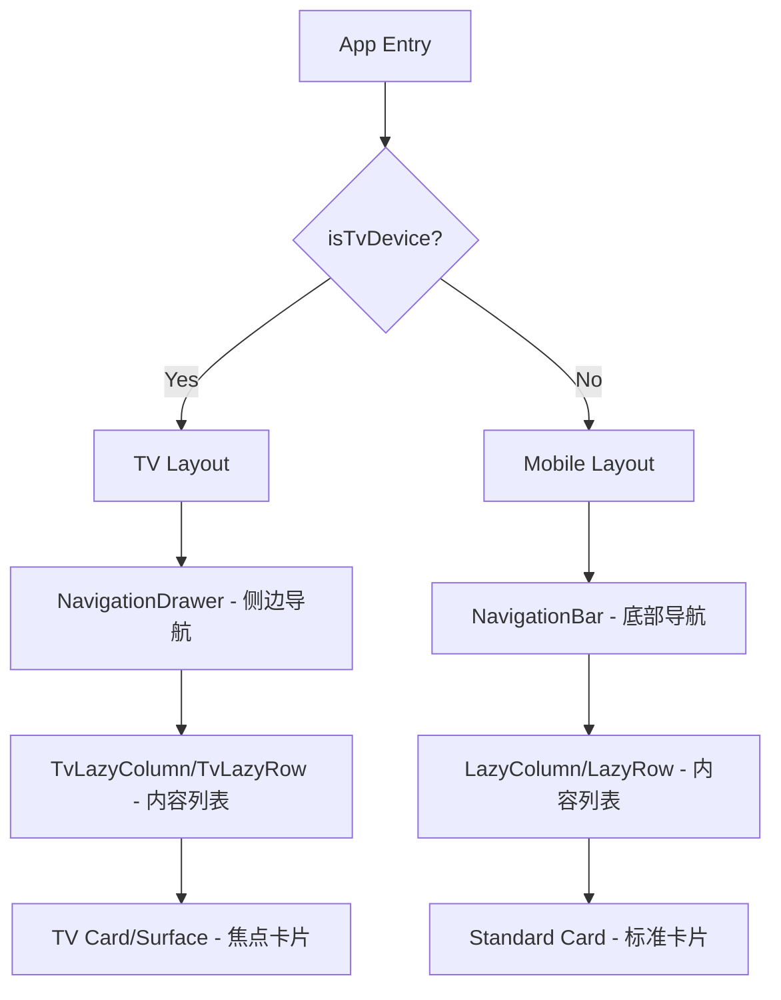
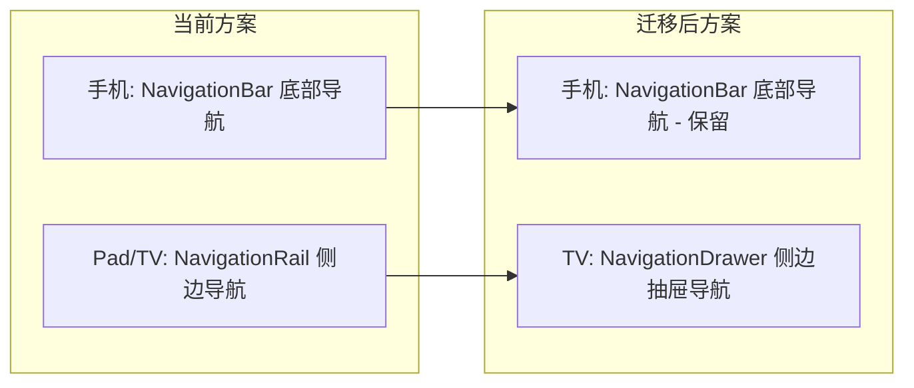
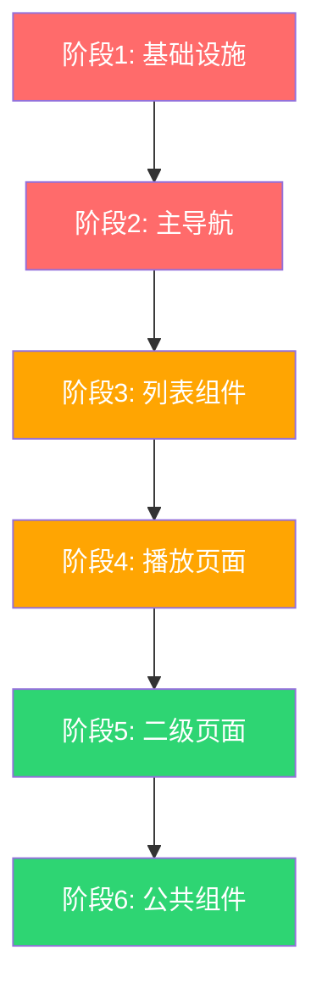

# EasyBangumi Compose for TV 迁移方案

## 1. 项目概述

将 EasyBangumi 项目的 UI 层从标准 Jetpack Compose（Material3）完整迁移到 Compose for TV（`androidx.tv:tv-foundation` + `androidx.tv:tv-material`），以原生支持 Android TV 遥控器（D-pad）操作。

---

## 2. 当前依赖分析

### 2.1 Compose 相关依赖（`gradle/compose.versions.toml`）

| 库 | 当前版本 |
|---|---------|
| `androidx.compose.ui:ui` | 1.7.4 |
| `androidx.compose.foundation:foundation` | 1.7.4 |
| `androidx.compose.material:material` | 1.7.4 |
| `androidx.compose.material3:material3` | 1.3.0 |
| `androidx.compose.animation:animation` | 1.7.4 |
| `androidx.compose.runtime:runtime-livedata` | 1.7.4 |

### 2.2 需要新增的 TV 依赖

```toml
# gradle/compose.versions.toml 新增
[versions]
tv-foundation = "1.0.0-alpha11"
tv-material = "1.0.0"

[libraries]
tv_foundation = {module = "androidx.tv:tv-foundation", version.ref = "tv-foundation"}
tv_material = {module = "androidx.tv:tv-material", version.ref = "tv-material"}

[bundles]
tv = ["tv_foundation", "tv_material"]
```

```kotlin
// app/build.gradle.kts 新增
implementation(compose.bundles.tv)
```

> **注意**：`tv-foundation` 和 `tv-material` 可与标准 `material3` 共存，迁移可以渐进式进行。

---

## 3. UI 文件结构总览

```
ui/
├── WebViewUser.kt                    # WebView 页面
├── about/About.kt                    # 关于页面
├── cartoon_play/                     # 播放相关（核心）
│   ├── CartoonComponent.kt           # 番剧详情组件（1020行）
│   ├── CartoonDownloadComponent.kt   # 下载组件
│   ├── CartoonPlay.kt               # 播放页面入口（614行）
│   ├── VideoComponent.kt            # 视频控制组件（1405行）
│   ├── cartoon_recorded/            # 录制相关
│   └── view_model/                  # ViewModel
├── common/                          # 公共组件（重点迁移）
│   ├── Action.kt                    # 操作按钮行
│   ├── CartoonCard.kt               # 番剧卡片（340行）
│   ├── CombineClickIconButton.kt    # 组合点击按钮
│   ├── EasyDialog.kt                # 对话框
│   ├── FastScrollToTopFab.kt        # 快速滚动FAB
│   ├── FocusHighlight.kt            # TV焦点高亮（已实现）
│   ├── MoeSnackBar.kt               # SnackBar
│   ├── Preference.kt                # 偏好设置组件
│   ├── SelectionTopAppBar.kt        # 选择模式顶栏
│   ├── TabPage.kt                   # Tab页面
│   ├── ToggleButton.kt              # 切换按钮
│   ├── page/CartoonPageUI.kt        # 番剧页面UI
│   ├── page/list/SourceListPage.kt  # 源列表页
│   ├── proc/                        # 筛选排序
│   └── cover_star/                  # 收藏封面
├── main/                            # 主界面（核心）
│   ├── Main.kt                      # 主入口+导航
│   ├── home/Home.kt                 # 首页
│   ├── star/Star.kt                 # 收藏页（779行）
│   ├── history/History.kt           # 历史页（488行）
│   └── more/More.kt                 # 更多页
├── search_migrate/                  # 搜索/迁移
├── setting/                         # 设置页面
├── source_manage/                   # 源管理
├── extension_push/                  # 扩展推送
├── dlna/Dlna.kt                     # DLNA投屏
├── storage/Storage.kt               # 存储管理
├── story/                           # 本地/下载
└── tags/CartoonTagManage.kt         # 标签管理
```

---

## 4. Material3 组件使用统计与 TV 映射

### 4.1 导航组件（最高优先级）

| Material3 组件 | 使用位置 | TV Material 替代 | 说明 |
|---|---|---|---|
| `NavigationBar` | `Main.kt:196` | `TabRow` / 自定义侧边栏 | 手机模式底部导航 → TV 不需要 |
| `NavigationBarItem` | `Main.kt:199` | `Tab` | 配合 TabRow |
| `NavigationRail` | `Main.kt:225` | `NavigationDrawer` | Pad/TV 模式侧边导航 → TV NavigationDrawer |
| `NavigationRailItem` | `Main.kt:231` | `NavigationDrawerItem` | 侧边导航项 |

### 4.2 顶部栏组件（高优先级）

| Material3 组件 | 使用文件数 | TV Material 替代 | 说明 |
|---|---|---|---|
| `TopAppBar` | 20+ 文件 | 保留或自定义 Row | TV 上 TopAppBar 不常用，可简化为 Row+Text |
| `TopAppBarDefaults` | 15+ 文件 | 移除 | TV 不需要滚动行为 |
| `TopAppBarScrollBehavior` | 10+ 文件 | 移除 | TV 不需要嵌套滚动 |

### 4.3 列表组件（高优先级）

| Compose Foundation 组件 | 使用文件数 | TV Foundation 替代 | 说明 |
|---|---|---|---|
| `LazyColumn` | 18 文件 | `TvLazyColumn` | 自动焦点管理 |
| `LazyRow` | 5 文件 | `TvLazyRow` | 自动焦点管理 |
| `LazyVerticalGrid` | 8 文件 | `TvLazyVerticalGrid` | 自动焦点管理 |

### 4.4 卡片/按钮组件（中优先级）

| Material3 组件 | 使用位置 | TV Material 替代 | 说明 |
|---|---|---|---|
| `Card` | `MoeSnackBar.kt` | `Card`（tv-material） | TV Card 内置焦点 |
| `Button` | `CartoonDownloadComponent.kt` | `Button`（tv-material） | TV Button 内置焦点 |
| `IconButton` | 30+ 处 | `IconButton`（tv-material）或保留+focusHighlight | 需要焦点支持 |
| `FloatingActionButton` | 5 文件 | `Button`（tv-material） | TV 无 FAB 概念 |
| `ExtendedFloatingActionButton` | 5 文件 | `Button`（tv-material） | TV 无 FAB 概念 |
| `FilterChip` | `CartoonPageUI.kt`, `ExtensionPush.kt` | `FilterChip`（tv-material） | TV FilterChip 内置焦点 |
| `FilledTonalButton` | 3 文件 | `Button`（tv-material） | 样式调整 |
| `TextButton` | 10+ 文件 | `Button`（tv-material） | 样式调整 |
| `OutlinedButton` | 1 文件 | `OutlinedButton`（tv-material） | 样式调整 |

### 4.5 对话框/底部弹窗组件（中优先级）

| Material3 组件 | 使用文件数 | TV Material 替代 | 说明 |
|---|---|---|---|
| `AlertDialog` | 10+ 文件 | 保留 Material3 AlertDialog | TV Material 无专用 Dialog |
| `ModalBottomSheet` | 3 文件 | 自定义侧边面板或 Dialog | TV 无底部弹窗概念 |
| `BottomAppBar` | 2 文件 | 自定义 Row 或移除 | TV 无底部栏 |

### 4.6 Tab 组件（中优先级）

| Material3 组件 | 使用文件数 | TV Material 替代 | 说明 |
|---|---|---|---|
| `ScrollableTabRow` | 3 文件 | `TabRow`（tv-material） | TV TabRow 内置焦点 |
| `TabRow` | 3 文件 | `TabRow`（tv-material） | TV TabRow 内置焦点 |
| `Tab` | 6 文件 | `Tab`（tv-material） | TV Tab 内置焦点 |

### 4.7 列表项组件（低优先级）

| Material3 组件 | 使用文件数 | TV Material 替代 | 说明 |
|---|---|---|---|
| `ListItem` | 15+ 文件 | `ListItem`（tv-material）或自定义 Row | TV ListItem 内置焦点 |
| `Switch` | 5 文件 | 保留 Material3 Switch | TV Material 无专用 Switch |
| `Checkbox` | 4 文件 | 保留 Material3 Checkbox | TV Material 无专用 Checkbox |
| `RadioButton` | 3 文件 | 保留 Material3 RadioButton | TV Material 无专用 RadioButton |
| `Slider` | 2 文件 | 保留 Material3 Slider | 需添加 D-pad 支持 |
| `TextField` | 8 文件 | 保留 Material3 TextField | 需确保焦点可达 |
| `Divider` | 8 文件 | 保留 Material3 Divider | 无需替换 |
| `Badge` | 2 文件 | 保留 Material3 Badge | 无需替换 |
| `Surface` | 10+ 文件 | `Surface`（tv-material） | TV Surface 内置焦点 |

### 4.8 其他组件

| Material3 组件 | 使用位置 | TV Material 替代 | 说明 |
|---|---|---|---|
| `Scaffold` | `WebViewUser.kt` | 移除，改用 Column 布局 | TV 不使用 Scaffold |
| `Snackbar` | `MoeSnackBar.kt` | 保留或自定义 | TV 上 Snackbar 不常用 |
| `DropdownMenu` | 2 文件 | 自定义焦点菜单 | TV 无下拉菜单 |
| `CircularProgressIndicator` | 2 文件 | 保留 Material3 | 无需替换 |
| `LinearProgressIndicator` | 1 文件 | 保留 Material3 | 无需替换 |
| `PullRefreshIndicator` | 3 文件 | 移除 | TV 不支持下拉刷新 |

---

## 5. 已有的 TV 适配基础

项目中已经有一些 TV 适配的基础工作：

### 5.1 `FocusHighlight.kt` — 焦点高亮修饰符（已完成）
- 提供 `Modifier.focusHighlight()` 扩展
- 支持自定义形状、边框宽度、背景色
- 已在 `Main.kt`、`Star.kt`、`Home.kt`、`CartoonPageUI.kt`、`Action.kt`、`CombineClickIconButton.kt` 等多处使用

### 5.2 `CartoonCard.kt` — 卡片焦点支持（已完成）
- `CartoonCardWithCover`、`CartoonStarCardWithCover`、`CartoonCardWithoutCover` 均已添加 `onFocusChanged` + 边框高亮

### 5.3 `Main.kt` — Pad/TV 模式（部分完成）
- 已有 `isCurPadeMode()` 判断，TV 模式使用 `NavigationRail` + 直接渲染页面
- `NavigationRailItem` 已添加 `onFocusChanged` 自动切换页面 + `focusHighlight`

### 5.4 `TvUtils` — TV 设备检测（已完成）
- 多处使用 `TvUtils.isTvDevice()` 判断是否为 TV 设备
- TV 模式下禁用下拉刷新、禁用嵌套滚动

---

## 6. 迁移架构设计

### 6.1 整体架构



### 6.2 导航迁移方案



---

## 7. 分阶段迁移计划

### 阶段 1：基础设施（依赖与公共组件）

#### 1.1 添加 TV 依赖
- 修改 `gradle/compose.versions.toml`，添加 `tv-foundation` 和 `tv-material`
- 修改 `app/build.gradle.kts`，添加 `implementation(compose.bundles.tv)`

#### 1.2 创建 TV 组件包装层
- 创建 `ui/common/tv/` 目录
- 封装 TV 版本的通用组件（TvListItem、TvCard 等）
- 提供统一的 `@Composable` 函数，内部根据 `isTvDevice()` 分发

### 阶段 2：主导航迁移（Main.kt）

#### 2.1 迁移 `Main.kt`
- **手机模式**：保留 `NavigationBar` + `NavigationBarItem`
- **TV 模式**：替换 `NavigationRail` → `NavigationDrawer` + `NavigationDrawerItem`
  - 使用 `androidx.tv.material3.NavigationDrawer`
  - 焦点从导航项移到内容区时自动收起抽屉
  - 按遥控器左键展开抽屉

#### 2.2 具体修改

```
文件: ui/main/Main.kt
- 导入: 添加 androidx.tv.material3.NavigationDrawer 等
- NavigationRail → NavigationDrawer
- NavigationRailItem → NavigationDrawerItem
- 移除 HorizontalPager（TV模式已不使用）
```

### 阶段 3：列表组件迁移

#### 3.1 收藏页 `Star.kt`
```
文件: ui/main/star/Star.kt
- LazyVerticalGrid → TvLazyVerticalGrid
- 移除 PullRefreshIndicator（TV模式已条件移除）
- 移除 nestedScroll（TV模式已条件移除）
- TopAppBar → 简化为 Row（TV模式）
- BottomAppBar → 移到侧边面板或 Dialog
- ModalBottomSheet → Dialog 或侧边面板
- FloatingActionButton → 固定按钮或菜单项
```

#### 3.2 首页 `Home.kt`
```
文件: ui/main/home/Home.kt
- ModalBottomSheet → Dialog
- TopAppBar → 简化为 Row（TV模式）
- LazyColumn（HomeBottomSheet内）→ TvLazyColumn
```

#### 3.3 历史页 `History.kt`
```
文件: ui/main/history/History.kt
- LazyColumn → TvLazyColumn
- TopAppBar → 简化为 Row（TV模式）
```

#### 3.4 更多页 `More.kt`
```
文件: ui/main/more/More.kt
- ListItem → TV ListItem（内置焦点）
- verticalScroll → TvLazyColumn
```

#### 3.5 番剧页面 `CartoonPageUI.kt` + `SourceListPage.kt`
```
文件: ui/common/page/CartoonPageUI.kt
- LazyRow → TvLazyRow
- FilterChip → TV FilterChip
- 移除 PullRefreshIndicator（TV模式已条件移除）

文件: ui/common/page/list/SourceListPage.kt
- LazyVerticalGrid → TvLazyVerticalGrid
- LazyRow → TvLazyRow
```

### 阶段 4：播放页面迁移

#### 4.1 播放详情 `CartoonComponent.kt`
```
文件: ui/cartoon_play/CartoonComponent.kt
- LazyVerticalGrid → TvLazyVerticalGrid
- ScrollableTabRow → TV TabRow
- Tab → TV Tab
- ModalBottomSheet → 侧边面板
- ExtendedFloatingActionButton → 固定按钮
- ListItem → TV ListItem
- Checkbox → 保留 + focusHighlight
- Slider → 保留 + D-pad 支持
```

#### 4.2 视频控制 `VideoComponent.kt`
```
文件: ui/cartoon_play/VideoComponent.kt
- LazyColumn（集数列表）→ TvLazyColumn
- IconButton → 保留 + focusHighlight（已部分完成）
- 确保 DpadVideoController 正常工作
```

#### 4.3 播放入口 `CartoonPlay.kt`
```
文件: ui/cartoon_play/CartoonPlay.kt
- Surface → TV Surface
- AlertDialog → 保留
- EasyPlayerScaffoldBase → 确保 TV 兼容
```

#### 4.4 下载组件 `CartoonDownloadComponent.kt`
```
文件: ui/cartoon_play/CartoonDownloadComponent.kt
- LazyVerticalGrid → TvLazyVerticalGrid
- LazyColumn → TvLazyColumn
- TopAppBar → 简化
- Button/FilledTonalButton → TV Button
```

### 阶段 5：二级页面迁移

#### 5.1 搜索页面
```
文件: ui/search_migrate/search/Search.kt
- TopAppBar → 简化
- DropdownMenu → 焦点菜单

文件: ui/search_migrate/search/normal/NormalSearch.kt
- LazyColumn → TvLazyColumn
- ScrollableTabRow → TV TabRow

文件: ui/search_migrate/search/gather/GatherSearch.kt
- LazyColumn → TvLazyColumn
- LazyRow → TvLazyRow
```

#### 5.2 迁移页面
```
文件: ui/search_migrate/migrate/Migrate.kt
- LazyColumn → TvLazyColumn
- TopAppBar → 简化
- BottomAppBar → 移除/替代
- FloatingActionButton → 固定按钮
- ExtendedFloatingActionButton → 固定按钮
```

#### 5.3 设置页面
```
文件: ui/setting/Setting.kt
- TopAppBar → 简化
- ListItem → TV ListItem

文件: ui/setting/AppearanceSetting.kt
- LazyRow → TvLazyRow

文件: ui/setting/PlayerSetting.kt
- ListItem → TV ListItem
- Slider → 保留 + D-pad 支持
```

#### 5.4 源管理页面
```
文件: ui/source_manage/SourceManager.kt
- TabRow → TV TabRow

文件: ui/source_manage/source/Source.kt
- LazyColumn → TvLazyColumn
- ListItem → TV ListItem

文件: ui/source_manage/extension/Extension.kt
- LazyColumn → TvLazyColumn

文件: ui/source_manage/extension/ExtensionV2.kt
- LazyColumn → TvLazyColumn
```

#### 5.5 其他页面
```
文件: ui/storage/Storage.kt
- LazyColumn → TvLazyColumn
- TopAppBar → 简化
- ExtendedFloatingActionButton → 固定按钮

文件: ui/tags/CartoonTagManage.kt
- LazyColumn → TvLazyColumn
- ExtendedFloatingActionButton → 固定按钮

文件: ui/dlna/Dlna.kt
- LazyColumn → TvLazyColumn
- LazyVerticalGrid → TvLazyVerticalGrid

文件: ui/about/About.kt
- TopAppBar → 简化
- ListItem → TV ListItem

文件: ui/extension_push/ExtensionPush.kt
- LazyColumn → TvLazyColumn
- FilterChip → TV FilterChip
- ExtendedFloatingActionButton → 固定按钮

文件: ui/extension_push/ExtensionRepository.kt
- LazyColumn → TvLazyColumn
- ExtendedFloatingActionButton → 固定按钮

文件: ui/WebViewUser.kt
- Scaffold → Column 布局
```

### 阶段 6：公共组件迁移

```
文件: ui/common/TabPage.kt
- ScrollableTabRow → TV TabRow
- Tab → TV Tab
- HorizontalPager → 保留或替换

文件: ui/common/SelectionTopAppBar.kt
- TopAppBar → 简化为 Row（TV模式）

文件: ui/common/FastScrollToTopFab.kt
- FloatingActionButton → TV 模式下隐藏或改为按键触发

文件: ui/common/MoeSnackBar.kt
- Card → TV Card
- Snackbar → 保留

文件: ui/common/EasyDialog.kt
- AlertDialog → 保留
- LazyColumn → TvLazyColumn
- Checkbox → 保留 + focusHighlight

文件: ui/common/Preference.kt
- ListItem → TV ListItem
- AlertDialog → 保留
- LazyColumn → TvLazyColumn
- Switch/RadioButton → 保留

文件: ui/common/ToggleButton.kt
- Button → TV Button
```

---

## 8. 焦点管理策略

### 8.1 焦点恢复
- 每个页面切换时保存/恢复焦点位置
- 使用 `FocusRequester` + `saveable` 状态

### 8.2 焦点导航规则
- **列表内**：上下左右自然导航（TvLazy* 自动处理）
- **页面间**：左键回到导航栏，右键进入内容区
- **对话框**：焦点陷阱，Esc/Back 关闭
- **播放器**：D-pad 中键暂停/播放，左右快进快退

### 8.3 初始焦点
- 每个页面需要指定初始焦点元素
- 使用 `FocusRequester.requestFocus()` 在 `LaunchedEffect` 中设置

---

## 9. 需要移除/替换的交互模式

| 手机交互 | TV 替代方案 | 涉及文件 |
|---|---|---|
| 下拉刷新 PullRefresh | 按钮触发刷新 | Star.kt, CartoonPageUI.kt, SourceListPageGroup.kt, ExtensionV2.kt |
| 长按 combinedClickable | 长按遥控器确认键 或 菜单键 | CartoonCard.kt, History.kt, Star.kt |
| 滑动手势 SwipeToDismiss | Back 键关闭 | MoeSnackBar.kt |
| 底部弹窗 ModalBottomSheet | Dialog 或侧边面板 | Star.kt, Home.kt, CartoonComponent.kt |
| 下拉菜单 DropdownMenu | 焦点列表菜单 | Search.kt, Migrate.kt |
| 嵌套滚动 nestedScroll | 移除（TV 不需要） | 多个文件 |
| 触摸拖拽排序 | D-pad 排序操作 | CartoonTagManage.kt, Source.kt |

---

## 10. 迁移优先级总结



| 优先级 | 阶段 | 涉及文件数 | 说明 |
|---|---|---|---|
| 🔴 最高 | 阶段1: 基础设施 | 2 | 添加依赖、创建包装层 |
| 🔴 最高 | 阶段2: 主导航 | 1 | Main.kt 导航迁移 |
| 🟠 高 | 阶段3: 列表组件 | 6 | 主要页面列表迁移 |
| 🟠 高 | 阶段4: 播放页面 | 4 | 播放相关迁移 |
| 🟢 中 | 阶段5: 二级页面 | 15+ | 设置、搜索等页面 |
| 🟢 中 | 阶段6: 公共组件 | 8 | 通用组件迁移 |

---

## 11. 迁移注意事项

### 11.1 兼容性
- TV Material 组件与 Material3 组件可以共存
- 建议使用 `isTvDevice()` 条件分发，保持手机端不受影响
- 部分 Material3 组件（AlertDialog、Switch、Checkbox 等）在 TV 上可直接使用，只需确保焦点可达

### 11.2 测试要点
- 每个页面的焦点导航路径
- 遥控器所有按键（方向键、确认、返回、菜单）的响应
- 焦点在页面切换后的恢复
- 长列表的焦点滚动行为
- 播放器控制的 D-pad 操作

### 11.3 已有 TV 适配可复用
- `FocusHighlight.kt` 的 `focusHighlight()` 修饰符可继续使用
- `TvUtils.isTvDevice()` 检测逻辑可继续使用
- `CartoonCard.kt` 的焦点边框逻辑可作为参考
- `Main.kt` 的 `onFocusChanged` 自动切换页面逻辑可保留

### 11.4 import 变更规则
迁移时需要注意 import 路径的变更：

```kotlin
// 列表组件
- import androidx.compose.foundation.lazy.LazyColumn
+ import androidx.tv.foundation.lazy.list.TvLazyColumn

- import androidx.compose.foundation.lazy.LazyRow  
+ import androidx.tv.foundation.lazy.list.TvLazyRow

- import androidx.compose.foundation.lazy.grid.LazyVerticalGrid
+ import androidx.tv.foundation.lazy.grid.TvLazyVerticalGrid

// 导航组件
- import androidx.compose.material3.NavigationRail
+ import androidx.tv.material3.NavigationDrawer

// Tab 组件
- import androidx.compose.material3.TabRow
+ import androidx.tv.material3.TabRow

- import androidx.compose.material3.Tab
+ import androidx.tv.material3.Tab

// 卡片/Surface
- import androidx.compose.material3.Surface
+ import androidx.tv.material3.Surface  // TV 模式

- import androidx.compose.material3.Card
+ import androidx.tv.material3.Card  // TV 模式

// 按钮
- import androidx.compose.material3.Button
+ import androidx.tv.material3.Button  // TV 模式
```

---

## 12. 文件修改清单（按优先级排序）

### 🔴 最高优先级

| 文件 | 修改内容 |
|---|---|
| `gradle/compose.versions.toml` | 添加 tv-foundation、tv-material 依赖 |
| `app/build.gradle.kts` | 添加 TV bundles 引用 |
| `ui/main/Main.kt` | NavigationRail → NavigationDrawer；条件分发 TV/手机布局 |

### 🟠 高优先级

| 文件 | 修改内容 |
|---|---|
| `ui/main/star/Star.kt` | LazyVerticalGrid → TvLazyVerticalGrid；TopAppBar 简化；BottomAppBar/FAB 替换；ModalBottomSheet → Dialog |
| `ui/main/home/Home.kt` | ModalBottomSheet → Dialog；TopAppBar 简化 |
| `ui/main/history/History.kt` | LazyColumn → TvLazyColumn；TopAppBar 简化 |
| `ui/main/more/More.kt` | ListItem → TV ListItem；verticalScroll → TvLazyColumn |
| `ui/common/page/CartoonPageUI.kt` | LazyRow → TvLazyRow；FilterChip → TV FilterChip |
| `ui/common/page/list/SourceListPage.kt` | LazyVerticalGrid → TvLazyVerticalGrid；LazyRow → TvLazyRow |
| `ui/cartoon_play/CartoonComponent.kt` | LazyVerticalGrid → TvLazyVerticalGrid；ScrollableTabRow → TV TabRow；ModalBottomSheet → 侧边面板 |
| `ui/cartoon_play/VideoComponent.kt` | LazyColumn → TvLazyColumn；确保 D-pad 控制 |
| `ui/cartoon_play/CartoonPlay.kt` | Surface → TV Surface |
| `ui/cartoon_play/CartoonDownloadComponent.kt` | LazyVerticalGrid/LazyColumn → TV 版本 |

### 🟢 中优先级

| 文件 | 修改内容 |
|---|---|
| `ui/common/TabPage.kt` | ScrollableTabRow → TV TabRow；Tab → TV Tab |
| `ui/common/SelectionTopAppBar.kt` | TopAppBar → Row（TV模式） |
| `ui/common/FastScrollToTopFab.kt` | FAB → TV 模式隐藏 |
| `ui/common/EasyDialog.kt` | LazyColumn → TvLazyColumn |
| `ui/common/Preference.kt` | ListItem → TV ListItem；LazyColumn → TvLazyColumn |
| `ui/common/ToggleButton.kt` | Button → TV Button |
| `ui/common/MoeSnackBar.kt` | Card → TV Card |
| `ui/setting/Setting.kt` | TopAppBar 简化；ListItem → TV ListItem |
| `ui/setting/AppearanceSetting.kt` | LazyRow → TvLazyRow |
| `ui/search_migrate/search/Search.kt` | TopAppBar 简化；DropdownMenu → 焦点菜单 |
| `ui/search_migrate/search/normal/NormalSearch.kt` | LazyColumn → TvLazyColumn；ScrollableTabRow → TV TabRow |
| `ui/search_migrate/search/gather/GatherSearch.kt` | LazyColumn/LazyRow → TV 版本 |
| `ui/search_migrate/migrate/Migrate.kt` | LazyColumn → TvLazyColumn；BottomAppBar/FAB 替换 |
| `ui/source_manage/SourceManager.kt` | TabRow → TV TabRow |
| `ui/source_manage/source/Source.kt` | LazyColumn → TvLazyColumn |
| `ui/source_manage/extension/Extension.kt` | LazyColumn → TvLazyColumn |
| `ui/source_manage/extension/ExtensionV2.kt` | LazyColumn → TvLazyColumn |
| `ui/storage/Storage.kt` | LazyColumn → TvLazyColumn；FAB 替换 |
| `ui/tags/CartoonTagManage.kt` | LazyColumn → TvLazyColumn；FAB 替换 |
| `ui/dlna/Dlna.kt` | LazyColumn/LazyVerticalGrid → TV 版本 |
| `ui/about/About.kt` | TopAppBar 简化；ListItem → TV ListItem |
| `ui/extension_push/ExtensionPush.kt` | LazyColumn → TvLazyColumn；FilterChip/FAB 替换 |
| `ui/extension_push/ExtensionPushV2.kt` | TabRow → TV TabRow |
| `ui/extension_push/ExtensionRepository.kt` | LazyColumn → TvLazyColumn；FAB 替换 |
| `ui/WebViewUser.kt` | Scaffold → Column |
| `ui/story/local/Local.kt` | LazyVerticalGrid → TvLazyVerticalGrid |
| `ui/story/download/Download.kt` | LazyColumn → TvLazyColumn |
